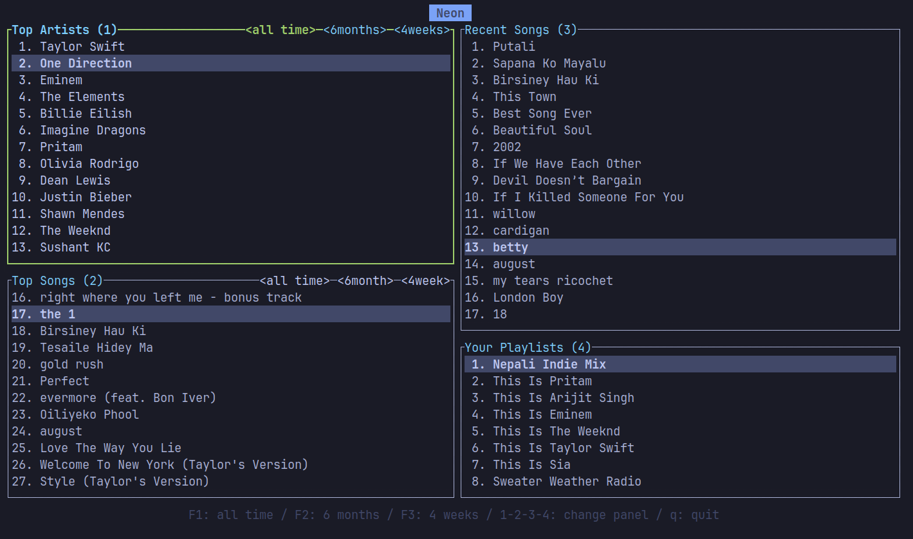

<div align="center">

</img>

[](https://crates.io/crate/sprofile)
[](https://aur.archlinux.org/packages/sprofile)
[](https://opensource.org/license/mit)

⚡ Blazingly fast TUI application for viewing your Spotify listening activity.

[Getting started](#getting-started) • [Installation](#installation) • [Usage](#usage)

</div>

## Getting Started



<br />
<br />

The easiest way to get Sprofile running is by installing it from [crates.io](https://crates.io/crate/sprofile) using
```
cargo install sprofile
```
**However, if you want OS-specific installation guides, please refer to [Installation Section](#installation)**.

## Installation

- ### Arch Linux

    Use our [AUR Package](https://aur.archlinux.org/packages/sprofile) to install Sprofile on Arch Linux based machines.
    ```
    yay -S sprofile
    ```
- ### Cargo
    ```
    cargo install sprofile
    ```
- ### Build from source

    Dependencies:
    - [rust](https://doc.rust-lang.org/cargo/getting-started/installation.html)
    - [cargo](https://doc.rust-lang.org/cargo/getting-started/installation.html)
    - [tar](https://www.gnu.org/software/tar/)
    - [curl](https://curl.se/) *(optional)\**
    - [jq](https://jqlang.github.io/jq/) *(optional)\**
    
    > **\*** required for downloading source code through CLI
    

    **Instructions:**

    First, download the latest source-code:
    ```
    curl -s https://api.github.com/repos/goodboyneon/sprofile/releases/latest | jq -r '.tarball_url' | xargs curl -L -o sprofile.tar.gz
    ```
    Then, extract the tar and cd into it:
    ```
    tar -xzf sprofile.tar.gz
    cd sprofile/
    ```
    Finally, build the file with `cargo`:
    ```
    cargo build
    ```
    Now, you can run Sprofile with `cargo`:
    ```
    cargo run
    ```
    > For convenience, you can create an executable for the package and run it from anywhere on the file system. 

## Usage

To run Sprofile, simply run `sprofile` in your shell:

```
sprofile
```
> If you installed Sprofile using cargo and running `sprofile` doesn't work, run the executable instead:
>
>    ```
>    ~/.cargo/bin/sprofile
>    ```


## License
[MIT](https://opensource.org/license/mit)
